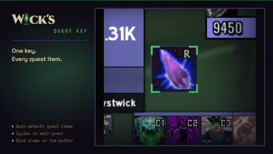

<p align="center"></p>

# Wick's Quest Key

> Retail-style ExtraActionButton for TBC Classic. One bind to use the active quest item, auto-detected from your quest log.

Part of the **[Wick suite](https://github.com/Wicksmods/WickSuite)**: precision addons built around a single fel-green-on-deep-purple aesthetic.

<!-- wick:suite-table:start -->
| Addon | GitHub | CurseForge |
|---|---|---|
| **Wick's TBC BIS Tracker** | [repo](https://github.com/Wicksmods/WickidsTBCBISTracker) | [CurseForge](https://www.curseforge.com/wow/addons/wicks-tbc-bis-tracker) |
| **Wick's CD Tracker** | [repo](https://github.com/Wicksmods/WicksCDTracker) | [CurseForge](https://www.curseforge.com/wow/addons/wicks-cd-tracker) |
| **Wick's Trade Hall** | [repo](https://github.com/Wicksmods/WicksTradeHall) | [CurseForge](https://www.curseforge.com/wow/addons/trade-hall) |
| **Wick's Macro Builder** | [repo](https://github.com/Wicksmods/WicksMacroBuilder) | [CurseForge](https://www.curseforge.com/wow/addons/wicks-macro-builder) |
| **Wick's Combat Log** | [repo](https://github.com/Wicksmods/WicksCombatLog) | [CurseForge](https://www.curseforge.com/wow/addons/wicks-combat-log) |
| **Wick's Stats** | [repo](https://github.com/Wicksmods/WicksStats) | [CurseForge](https://www.curseforge.com/wow/addons/wicks-stats) |
| **Wick's Quest Key** | [repo](https://github.com/Wicksmods/WicksQuestKey) | [CurseForge](https://www.curseforge.com/wow/addons/wicks-quest-key) |
| **Wick's Layers** | [repo](https://github.com/Wicksmods/WicksLayers) | [CurseForge](https://www.curseforge.com/wow/addons/wicks-layers) |
| **Wick's Totems and Things** | [repo](https://github.com/Wicksmods/WicksTotemsAndThings) | [CurseForge](https://www.curseforge.com/wow/addons/wicks-totems-and-things) |
<!-- wick:suite-table:end -->

## Features

- **Auto-detects quest items** from every active quest in your log (no list to maintain).
- **Cycles on each press** so a single bind covers every quest item you're holding.
- **Right-click to skip** to the next item without using the current one.
- **Bind shown on the button** so you always know which key is wired to it.
- **Hides when empty.** No quest items in your log? The button gets out of the way.
- **Wick chrome.** Flat dark-purple panel, fel-green L-bracket corners, draggable position remembered per character.

## Install

- **CurseForge:** [curseforge.com/wow/addons/wicks-quest-key](https://www.curseforge.com/wow/addons/wicks-quest-key)
- **Manual:** download the latest ZIP from [Releases](https://github.com/Wicksmods/WicksQuestKey/releases) and extract the `WicksQuestKey` folder into `World of Warcraft\_classic_\Interface\AddOns\`.

## Usage

```
/wqk
```

Lists what is currently loaded. Then bind a key in *Esc → Key Bindings → Wick's Quest Key → Use current quest item*.

| Command | Effect |
|---|---|
| `/wqk` | Show the loaded quest items |
| `/wqk unlock` | Unlock the button so it can be dragged |
| `/wqk lock` | Lock it back into place |
| `/wqk reset` | Reset position to the default |

## Compatibility

- **TBC Classic (Burning Crusade / Anniversary)** — Interface `20505`.
- Detects quest items via `GetQuestLogSpecialItemInfo` — same API Blizzard's auto-quest-item button uses.

## Brand

Uses the locked Wick palette and 10px/2px fel-green L-bracket chrome. See:
- `WicksQuestKey.lua` — palette tokens at the top of the file
- `CHANGELOG.md` — version history

## License

See `LICENSE` — MIT with a trademark carve-out for the Wick name, logomark, and visual system. Full trademark policy: [WickSuite/TRADEMARK.md](https://github.com/Wicksmods/WickSuite/blob/main/TRADEMARK.md).
